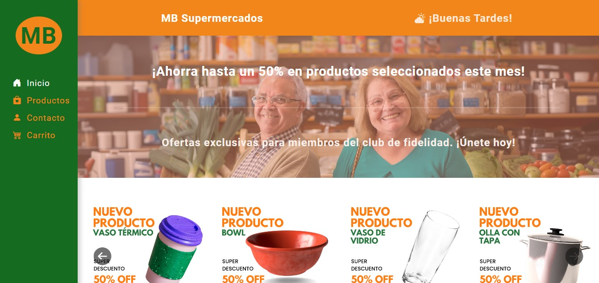
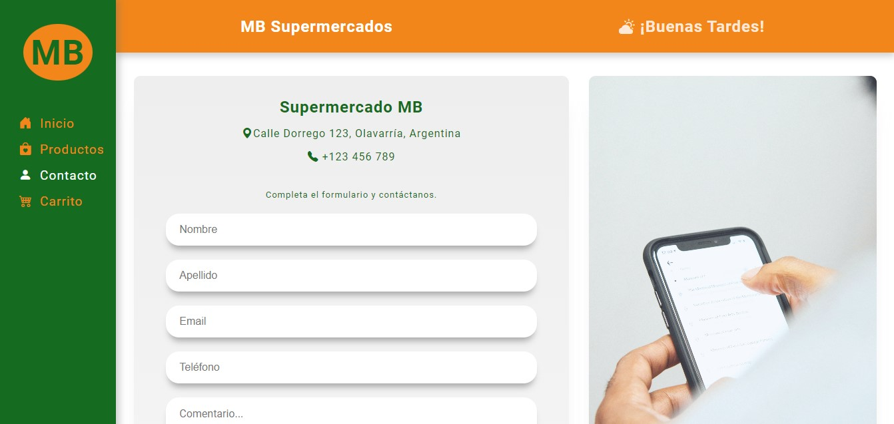

# Página Web de Supermercado

Este proyecto es un ejercicio práctico de un curso FullStack en CEPIT. Es una página web para un supermercado con las siguientes características:

## Características

### Home

 

- La página principal de inicio del sitio web del supermercado.

### Productos

 

- Muestra una lista de productos en formato de tarjeta.
- Los datos de los productos se generan a partir de un objeto JSON dentro del mismo archivo JavaScript.
- Cada tarjeta de producto incluye un campo de entrada para que el usuario ingrese la cantidad que desea comprar.
- Se verifica la disponibilidad de stock y se muestran mensajes apropiados:
  - Si no hay stock, se informa al usuario.
  - Si hay stock, se muestra el precio total basado en la cantidad ingresada.

### Contacto

 

- Proporciona información básica sobre el supermercado, como número de teléfono y dirección.
- Incluye un formulario de contacto donde los usuarios pueden ingresar sus datos.
- Al enviar el formulario, se genera un archivo TXT con los datos ingresados utilizando la librería FileSaver.

## Tecnologías Utilizadas

- **JavaScript**: Para la generación dinámica de contenido y manejo del formulario.
- **HTML y CSS**: Para estructurar y estilizar la página web.
- **Metodología BEM**: Utilizada para organizar el CSS y mejorar su mantenibilidad.
- **Diseño Responsivo**: Implementado con un enfoque mobile-first para asegurar la usabilidad en varios dispositivos.

## Instalación y Uso

1. Clona el repositorio:
   ```bash
   git clone https://github.com/braiandevcode/TP1-Frontend.git
   ```
